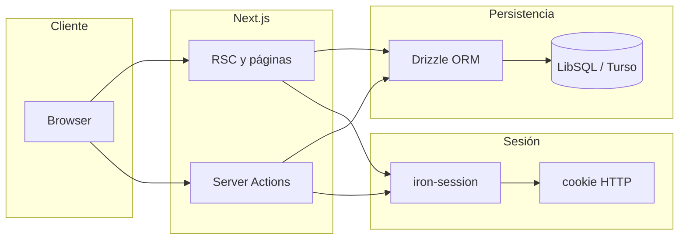

# Especificación — Recomendados

Documento de referencia para el producto y la implementación sobre el código base importado (`src/`). Complementa [IDEA.md](./IDEA.md).

---

## 1. Resumen ejecutivo y alcance

**Recomendados** es una aplicación web donde usuarios autenticados publican recomendaciones de películas, series o libros (título, descripción, imagen y enlace). El resto puede votar a favor o en contra **después** de haber visto o leído la obra, según la intención del producto. Los listados priorizan el consenso medido por votos.

**MVP:** registro/login, crear recomendación, votar, listado global y por usuario con orden definido, moderación mínima vía roles existentes (`user` / `admin`).

**Post-MVP / evolutivo:** reputación visible y consistente en perfil; refinamiento de reglas y, si aplica, notificaciones u otros canales no exigidos por la IDEA inicial.

---

## 2. Requisitos funcionales

| ID    | Requisito                   | Detalle                                                                                                                        |
| ----- | --------------------------- | ------------------------------------------------------------------------------------------------------------------------------ |
| RF-01 | Crear recomendación         | Usuario autenticado. Campos obligatorios: título, descripción, imagen, enlace externo a la ficha de la obra.                   |
| RF-02 | Votar                       | Voto **positivo** o **negativo** sobre una recomendación existente. Ver reglas en §3.2.                                        |
| RF-03 | Listar recomendaciones      | Vista principal con todas las recomendaciones ordenadas según §3.3.                                                            |
| RF-04 | Recomendaciones por usuario | Vista que lista las recomendaciones creadas por un usuario, **misma regla de orden** que el listado global.                    |
| RF-05 | Reputación                  | Cada usuario tiene un nivel de reputación que aumenta con las recomendaciones creadas y con los votos emitidos (fórmula §3.4). |
| RF-06 | Idioma de la interfaz       | Toda la UI visible para el usuario en **español**, con tono **rioplatense** cuando sea posible (§5.2).                         |

**Reglas de negocio implícitas en la IDEA**

- Solo usuarios autenticados crean recomendaciones y votan.
- Una recomendación tiene un único autor (`userId`).
- El producto asume buena fe: el voto “después de consumir” no se valida técnicamente en MVP.

---

## 3. Modelo de datos objetivo y reglas de negocio

### 3.1 Entidades

`**users`** (reutilizar y extender el concepto ya presente en el esquema importado)

- Identidad, credenciales, `role`, `status`, timestamps.
- **Reputación:** campo almacenado `reputation` (entero, default 0) actualizado al crear recomendaciones y al emitir votos, **o** valor derivado en consulta (preferir almacenado para listados rápidos; documentar la fuente de verdad en implementación).

`**recommendations`**

- `id`, `userId` (autor), `title`, `description`, `imageUrl`, `externalUrl`, `createdAt`, `updatedAt`.
- Opcional futuro: `type` (`movie` | `series` | `book`) si se quiere filtrar por medio.

`**recommendation_votes`**

- `userId`, `recommendationId`, `value` ∈ { +1, -1 }, `createdAt`, `updatedAt` (útil si se permite cambiar voto).
- **Restricción:** a lo sumo una fila por par (`userId`, `recommendationId`) — si el usuario cambia de opinión, se **actualiza** `value` (upsert).

### 3.2 Votación

- Un usuario puede tener como máximo un voto activo por recomendación (positivo o negativo).
- Cambiar de positivo a negativo (o viceversa) reemplaza el voto anterior; no se acumulan dos filas por el mismo par usuario–recomendación.

### 3.3 Ordenación de listados

La IDEA pide ordenar por “número de votos”. Para evitar ambigüedad:

- **Puntuación principal:** `score = (votos positivos) − (votos negativos)` (saldo neto).
- **Desempate:** por ejemplo `createdAt` descendente (más reciente primero) o `id` descendente; fijar una sola política en implementación y mantenerla igual en listado global y por usuario.

Si en el futuro se prefiere ordenar solo por positivos, será un cambio de producto explícito en este documento.

### 3.4 Reputación (fórmula inicial propuesta)

Valores concretos son ajustables; la IDEA exige que suba con recomendaciones creadas y con votos dados:

- **+R** puntos por cada recomendación creada (ej. `R = 5`).
- **+V** puntos por cada voto emitido (ej. `V = 1`), independientemente de si el voto es positivo o negativo **salvo** decisión de producto de no premiar votos negativos (ver §8).

Al eliminar o moderar contenido, definir si se revierten puntos (fuera de MVP salvo necesidad legal/abuso).

### 3.5 Deprecación del dominio importado (fútbol)

El `src/` actual proviene del proyecto **[matchday](https://github.com/joaquinponzone/matchday)** (partidos y mundial). Las tablas y flujos siguientes son **legado** respecto a Recomendados y deben eliminarse o sustituirse al migrar el esquema:

- `teams`, `matches`, `followedTeams`, `prodePredictions`
- `notifications` ligadas a `matchId` y flujos asociados
- Ajuste o eliminación de `settings` orientadas a Telegram / partidos si no aplican al nuevo producto

La tabla `users` y el patrón de autenticación/autorización se **reutilizan**.

---

## 4. Arquitectura técnica (código actual)

El repositorio está inicializado como app **Next.js** con el directorio `src/` copiado de otro proyecto. La especificación del **stack efectivo** se basa en ese código (no solo en `package.json` mínimo — ver §9).

### Referencia de arquitectura (matchday)

La disposición de carpetas y los patrones de implementación (sesión, DAL, Server Actions, capa de datos, intercepción de requests con `proxy`, etc.) siguen el proyecto de referencia **[matchday — `src/`](https://github.com/joaquinponzone/matchday/tree/main/src)**. Salvo decisión explícita y registrada en este documento, nuevas features y refactors deben **alinearse** con ese árbol y estilo. El `src/` de este repo parte de esa base; desviaciones accidentales conviene corregirlas o documentarlas aquí.

| Área              | Implementación en repo                                                                                                                                      |
| ----------------- | ----------------------------------------------------------------------------------------------------------------------------------------------------------- |
| Framework         | Next.js (App Router), `src/app/`                                                                                                                            |
| UI                | React 19, Tailwind CSS 4, componentes tipo shadcn en `src/components/ui/`, `ThemeProvider`, layout raíz en `src/app/layout.tsx`                             |
| Hooks compartidos | `src/hooks/` — hooks reutilizables para componentes cliente                                                                                                  |
| Datos             | **Drizzle ORM**: `src/server/db/schema.ts`, cliente **LibSQL** en `src/server/db/index.ts` (Turso u otro LibSQL compatible)                                |
| Consultas y DDL   | `src/server/db/queries.ts` — lecturas/escrituras reutilizables sobre el esquema; `src/server/db/migrations/`; `src/server/db/seed.ts`                         |
| Auth (sesión)     | **iron-session** en `src/lib/session.ts`; uso en login y en `src/proxy.ts` para la intercepción de requests                                                |
| Auth (servidor)   | `src/lib/dal.ts` (`verifySession`, `getUser`, `requireAdmin`) con `cache` de React — punto único para usuario autenticado en RSC/Server Actions que lo requieran |
| Intercepción      | `src/proxy.ts` — `getIronSession` sobre request/response, redirect a `/login` si no hay `userId`; `export const config.matcher` excluye rutas públicas y APIs que no deben forzar login (ver §6) |
| Autorización      | Campo `role` en `users` (p. ej. `admin`)                                                                                                                    |
| Mutaciones        | **Server Actions** colocalizadas (`*/actions.ts` junto a la ruta) y acciones transversales en `src/app/actions/` (p. ej. `logout.ts`)                           |
| API HTTP          | `src/app/api/` — ver §5.3 para legado vs patrón reutilizable                                                                                                 |
| Utilidades        | `src/lib/validations.ts`, `src/lib/utils.ts`; email / Telegram en `src/lib/` como integraciones opcionales heredadas                                        |
| Calidad           | Biome (`lint`, `format` en scripts de `package.json`)                                                                                                       |

### 4.1 Flujo lógico

### 4.2 Módulos solo servidor

- `src/lib/dal.ts` y el acceso a datos vía `src/server/db/queries.ts` deben importarse **solo** desde el servidor (RSC, Route Handlers, Server Actions). Donde corresponda, usar el paquete `server-only` para evitar que el bundle cliente arrastre código de servidor.

---

## 5. Estructura de carpetas y convenciones

### 5.1 Convenciones

- Rutas autenticadas agrupadas en `src/app/(app)/` con layout común (`Nav`, `Footer`) en `src/app/(app)/layout.tsx`.
- Preferir **React Server Components**; `"use client"` solo para estado local, browser APIs o interactividad puntual.

**Mapa de carpetas (patrón matchday)**

| Ubicación | Uso |
| --------- | --- |
| `src/app/` | Rutas, layouts, `api/`, páginas públicas de auth fuera de `(app)` |
| `src/app/actions/` | Server Actions **transversales** (logout, sincronizaciones u otras acciones invocadas desde varios lugares) |
| `src/app/<ruta>/actions.ts` | Server Actions **del flujo** de esa ruta (login, settings, futuras recomendaciones, etc.) |
| `src/components/` | UI compartida; `src/components/ui/` para primitivos estilo shadcn |
| `src/hooks/` | Hooks de React para componentes cliente |
| `src/lib/` | Sesión, DAL, validaciones, utilidades, integraciones (email, etc.) — lógica de aplicación no acoplada a una sola página |
| `src/server/db/` | Cliente Drizzle, `schema.ts`, `queries.ts`, migraciones, seed |

**DAL y sesión en páginas y acciones**

- Para obtener el usuario autenticado o exigir admin, usar `getUser`, `verifySession` o `requireAdmin` desde `@/lib/dal`, en lugar de repetir `getIronSession` + consultas a mano. **Excepción natural:** el flujo de **login** (y similares) que justamente establece o destruye la sesión.

**Validación de entrada**

- Esquemas en `src/lib/validations.ts` (p. ej. Zod) y validación en Server Actions con `safeParse` / manejo de errores devuelto al cliente, como en `src/app/login/actions.ts`.

### 5.2 Idioma de la interfaz (UI)

- **Siempre en español:** etiquetas, botones, títulos de página, navegación, mensajes de error y de éxito, estados vacíos, placeholders, ayudas en pantalla y cualquier otro texto que vea el usuario final.
- **Rioplatense cuando encaje:** priorizar formulaciones propias del español rioplatense (léxico y registro coherentes con la región); evitar mezclar variantes (p. ej. peninsular vs rioplatense) en el mismo flujo sin criterio.
- **Qué puede quedar en inglés:** nombres técnicos en código, rutas, variables, commits y documentación para desarrolladores; no sustituye copy visible en la app.
- El documento HTML debe mantener `lang="es"` (o el código BCP 47 acordado para español) en el layout raíz.

### 5.3 Rutas y APIs: reutilizable vs legado

**Patrón reutilizable**

- Login, registro, recuperación de contraseña (`src/app/login`, `register`, `forgot-password`, `reset-password`).
- Layout de app, componentes compartidos, DAL, sesión, Drizzle.

**Legado (fútbol / notificaciones de partidos) — sustituir por dominio Recomendados**

- `src/app/(app)/world-cup/`
- `src/app/actions/sync-fixtures.ts`
- APIs: `api/cron/sync-matches`, `api/cron/send-notifications`, `api/cron/daily` (revisar si algún “daily” sirve genéricamente; hoy acoplado al contexto importado)
- `api/teams/search`, `api/notifications/` en la medida en que dependan de partidos/usuarios-notificación del modelo viejo

**A definir al implementar**

- Nuevas rutas: feed principal, detalle de recomendación, crear/editar (si aplica), perfil de usuario con lista de recomendaciones y reputación.

---

## 6. Seguridad y sesión

- **`SESSION_SECRET`:** obligatorio para iron-session (`src/lib/session.ts`).
- **Base de datos:** `TURSO_DATABASE_URL` o `DATABASE_URL`; token opcional `TURSO_AUTH_TOKEN` o `DATABASE_AUTH_TOKEN` (`src/server/db/index.ts`).
- Cookie de sesión: el nombre actual puede seguir reflejando el proyecto anterior (`diadepartido-session`); conviene renombrar al estabilizar el producto (branding y cookies limpias).
- **`src/proxy.ts` y `config.matcher`:** deben excluir explícitamente rutas que no deben redirigir a login: al menos `login`, `register`, `forgot-password`, `reset-password`, assets de Next (`_next/static`, `_next/image`) y `favicon`. Si se mantienen jobs HTTP bajo `api/cron`, el matcher de referencia en **matchday** también los excluye (`api/cron`) para que el cron no quede bloqueado por la falta de sesión de navegador. Revisar **paridad** con el repo de referencia si este proyecto difiere (p. ej. matcher sin `api/cron`).
- Endpoints de cron y tareas internas: deben quedar protegidos por secreto compartido, IP allowlist o mecanismo equivalente al portar o reemplazar rutas.

---

## 7. Roadmap de implementación sugerido

1. **Esquema y migraciones:** tablas `recommendations` y `recommendation_votes`; extensión de `users` para reputación si se elige columna; migración o limpieza de tablas legado.
2. **Núcleo producto:** crear recomendación, votar (upsert), listados con orden §3.3, página de usuario.
3. **Reputación:** actualización transaccional al crear recomendación y al votar; mostrar en perfil.
4. **Pulido:** metadata/branding en `layout.tsx`, navegación, empty states, moderación admin si hace falta; revisar copy heredado para cumplir §5.2.
5. **Opcional:** email, Telegram u otras notificaciones (no requeridas por la IDEA en MVP).

---

## 8. Decisiones abiertas y fuera de alcance MVP

- Ponderación exacta de `R` y `V` en reputación (§3.4).
- Si los votos negativos suman igual a los positivos para reputación del votante.
- Imagen: en MVP se asume **URL** a imagen hospedada externamente; upload propio queda fuera salvo nueva decisión.
- Internacionalización: el producto se define hoy como **solo español** con criterio de UI en §5.2; un segundo idioma sería decisión explícita posterior.
- Módulos **cron**, **Telegram** y **notificaciones in-app** del proyecto importado: fuera de alcance del MVP de Recomendados salvo reutilización deliberada.

---

## 9. Deuda conocida: `package.json` vs imports

El `package.json` del repositorio puede listar menos dependencias de las que el código en `src/` importa (Drizzle, `@libsql/client`, iron-session, `@vercel/analytics`, Radix, etc.). Antes de compilar o desplegar, las dependencias deben alinearse con los imports reales. Esta especificación describe el **stack del código fuente**; sincronizar `package.json` (e instalar) es tarea de implementación posterior al documento.

---

## 10. Trazabilidad IDEA → SPECS

| IDEA                                                      | Sección SPECS                 |
| --------------------------------------------------------- | ----------------------------- |
| Nueva recomendación (título, descripción, imagen, enlace) | RF-01, §3.1 `recommendations` |
| Votar positivo/negativo                                   | RF-02, §3.2                   |
| Ver recomendaciones ordenadas por votos                   | RF-03, §3.3                   |
| Ver recomendaciones de un usuario + reputación            | RF-04, RF-05, §3.4            |
| (Convención de producto) UI en español rioplatense        | RF-06, §5.2                   |

